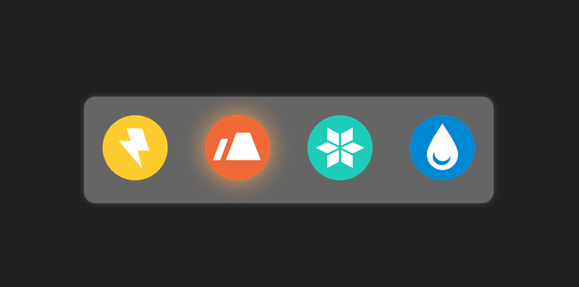

# Master INESDI 2025 / `components-introduction`

## Week 1: React Components

How React components enhance code reusability



From:

```jsx
<div className="element">
  
  ...
</div>
```

To:

```jsx
<Element type="electric" />
```

---

```bash
git clone https://github.com/manuartero/master-inesdi-components-introduction.git
cd master-inesdi-components-introduction
npm i && npm run dev
```
